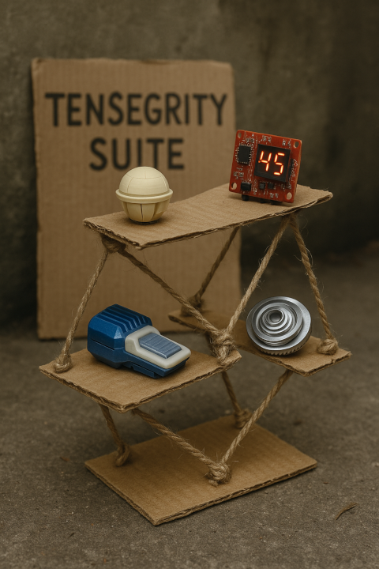

# Tensegrity 

[Latest - blog](https://tensegrity.it)

This is a suite of tools I've been building that are intended to work together. An aim is to keep them loosely coupled, as independent projects. Overall goals aren't much defined beyond enabling experimentation with interesting tech and trying to have fun in the process.  

### Systems
* [Transmissions](https://github.com/danja/transmissions) - pipeline composer
* [Semem](https://github.com/danja/semem) - semantic memory/knowledgegraph interface 
* [TIA Intelligence Agency](https://github.com/danja/tia) - templates for autonomous agents 

### Applications

* [Squirt](https://github.com/danja/squirt) - multi-purpose browser client
* [Atuin](https://github.com/danja/atuin) - RDF/SPARQL editor/client
* [Trestle](https://github.com/danja/trestle) - outliner, project management starter
* [Postcraft](https://github.com/danja/postcraft) - markdown doc manager/site builder (Transmissions app #1)

### Architecture
* [Ragno ontology](https://github.com/danja/ragno) - knowledgebase description
* [ZPT ontology](https://github.com/danja/zpt) - knowledgebase navigation
* [Lingue ontology](https://github.com/danja/lingue) - agent description, communication
* [Project ontology](https://purl.org/stuff/project) - project description

